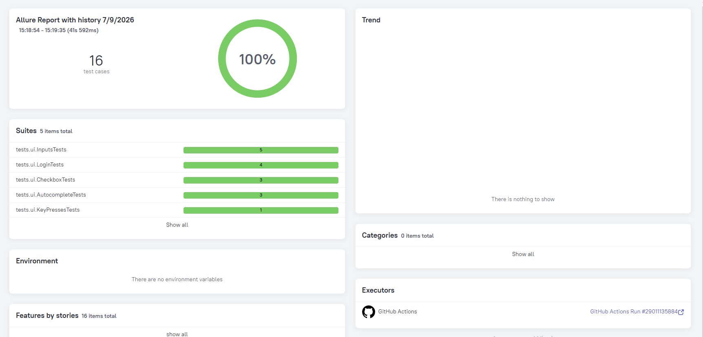
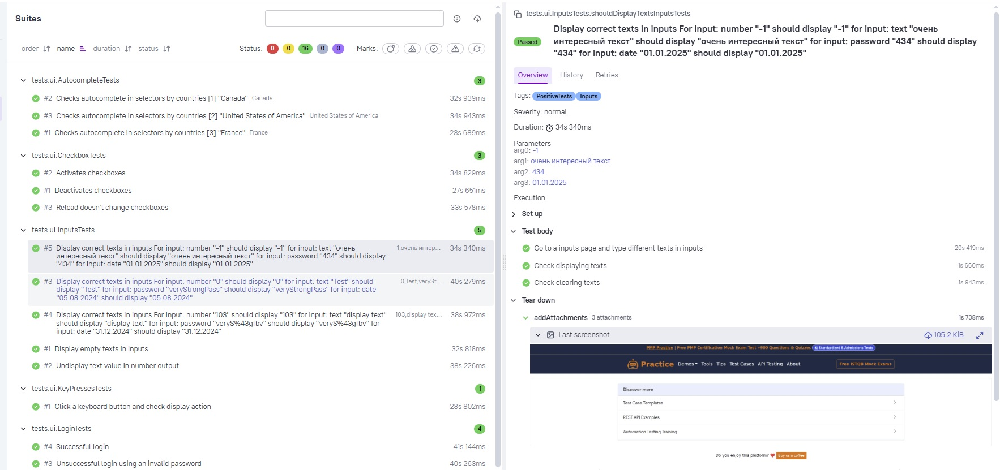

# UI tests for website: practice.expandtesting

[Link to practice.expandtesting web platform](https://practice.expandtesting.com/)

## 📃 Table of contents:
- [Technology stack](#-technology-stack)
- [Covered UI tests](#-covered-ui-tests)
- [Project architecture](#-project-architecture)
- [Running tests using terminal](#-running-tests-using-terminal)
- [CI/CD Deployment in GitHub Actions](#-cicd-deployment-in-github-actions)
- [Allure reports & GitHub Pages integration](#-allure-reports--github-pages-integration)

## 💻 Technology stack
Java | Selenide | Gradle 9.0 | JUnit 6 | Owner (aeonbits) | Allure Reports | Git | GitHubActions
<p>
<a href="https://www.java.com/"></a>
<a href="https://ru.selenide.org/"></a>
<a href="https://gradle.org/"></a>
<a href="https://junit.org/"></a>
<a href="https://github.com/allure-framework/allure2"></a>
<a href="https://git-scm.com/"></a>
<a href="https://github.com/features/actions"></a>
</p>

## 📑 Covered UI tests
* **Positive test case:**
    * ✔ Checks autocomplete in selectors by countries
    * ✔ Activates checkboxes
    * ✔ Deactivates checkboxes
    * ✔ Reload doesn't change checkboxes
    * ✔ Display correct texts in inputs
    * ✔ Display empty texts in inputs
    * ✔ Click a keyboard button and check display action
    * ✔ Test successful login with the correct credentials
* **Negative test case:**
    *  ❌Undisplay text value in number output
    *  ❌Unsuccessful login using an invalid username
    *  ❌Unsuccessful login using an invalid password
    *  ❌Unsuccessful login with empty credentials
 
## 🏗 Project architecture
The test automation framework follows a clean, layered architecture that strictly separates UI element interactions, test data management, configuration, and actual test scripts:
* **`tests/` (Test Execution Layer)** — Contains independent, highly isolated JUnit 6 test suites. These tests focus purely on executing user scenarios and validating assertions, keeping them clean, readable, and documentation-friendly.
* **`pages/` (Page Object Layer)** — Houses Page Objects representing web pages and components. It encapsulates UI elements, locators, and user interactions using Selenide.
* **`helpers/` (Reporting & Support Layer)** — Contains utility classes for test execution support, such as custom Allure attachments (screenshots, page source, browser logs) to enrich test reports.
* **`config/` (Configuration Layer)** — Manages environment-specific configurations and global browser settings using the Owner library. It automatically merges local configuration properties, system variables, and CI system settings.

## 🖥 Running tests using terminal
#### Command for local run:
*(Uses your local `api.properties` file for test credentials)*
```bash
./gradlew clean test
```
#### Command for custom environment run:
*(Overrides properties dynamically via CLI arguments)*
```bash
./gradlew test "-Dauth.username=<value username>" "-Dauth.password=value password" --no-daemon
```

## 🚀 CI/CD Deployment in GitHub Actions
The project features a completely automated build and test pipeline configured inside `.github/workflows/run-tests.yml`.
* **Triggers:** Runs automatically on every code `push` or `pull_request` to the `main` branch.
* **Security:** Sensitive credentials are secure and handled via Encrypted GitHub Repository Secrets (`AUTH_USERNAME` and `AUTH_PASSWORD`).
* **Environment:** Built on top of Ubuntu Linux running isolated steps with automated Gradle wrapper validation.

## 📊 Allure reports & GitHub Pages integration
[Link to Live Allure Reports on GitHub Pages](https://mikhail-malygin.github.io/ui-expand-testing/11/index.html)
#### Overview Dashboard
Detailed test summary reports featuring visual graphs, duration timelines, and specific execution metrics.

#### Suites & Test Structure
Detailed breakdown of each API step with full request/response logging integration for fast and efficient debugging.

#### Artifacts
Test runs automatically preserve raw test results as downloadable build artifacts inside GitHub Actions for up to 5 days.